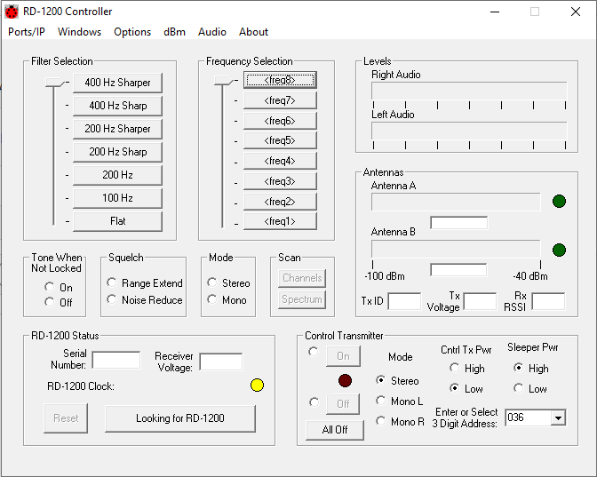

REM_RX_GUI
Remote Receiver GUI  
This is a Windows-based GUI to control a remote radio receiver via Internet. 
It is written in C++, using Microsoft Foundation Classes (MFC), to create Windows elements (buttons, menus, displays) and implement TCP/IP interface to the radio.   
Nowadays, GUIs for controlling embedded products tend to be implemented via an embedded Webpage interface, making Windows-based GUIs such as this obsolete.
But this code is intended to demonstrate coding a large C++ project to create a Windows application.
It also contains many useful coding tasks that apply widely (implementation of TCP/IP, computing CCITT checksums, etc.)  

